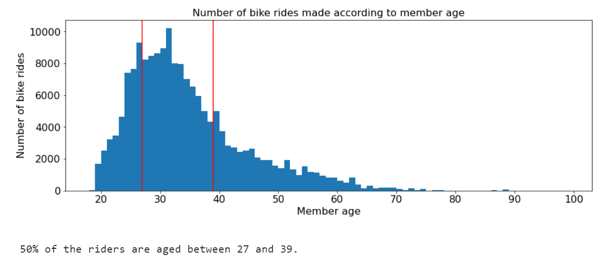
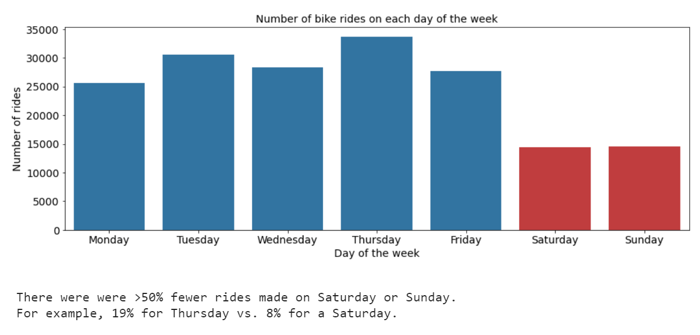
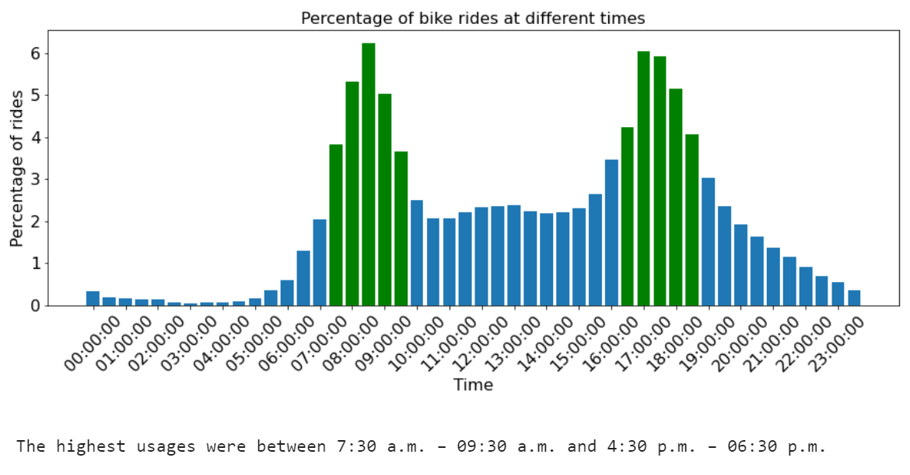
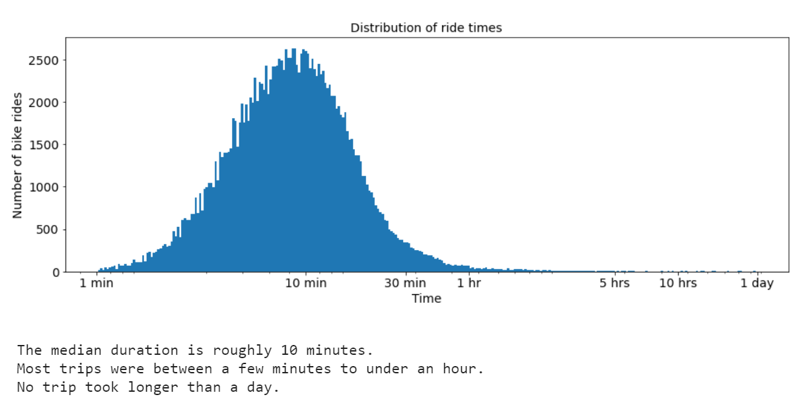

# Data analysis: Bike rides in San Francisco 
## by Renju Mathew  
&nbsp; 

The following files are included:
  
&nbsp;&nbsp;&nbsp;&nbsp;&nbsp;&nbsp;`201902-fordgobike-tripdata.zip` Raw data (csv).  
&nbsp;&nbsp;&nbsp;&nbsp;&nbsp;&nbsp;`exploration.html` A report with my exploratory data analysis in html format.   
&nbsp;&nbsp;&nbsp;&nbsp;&nbsp;&nbsp;`exploration.ipynb` The jupyter notebook used to produce the above.  
&nbsp;&nbsp;&nbsp;&nbsp;&nbsp;&nbsp;`slidedeck.slides.html` A slide deck presentation with explanatory analysis.  
&nbsp;&nbsp;&nbsp;&nbsp;&nbsp;&nbsp;`slidedeck.ipynb` The jupyter notebook used to produce the above.  
&nbsp;&nbsp;&nbsp;&nbsp;&nbsp;&nbsp;`slidedeck.html` The jupyter notebook in html format.  

Note: The slide deck presentation can be viewed in your web browser (use arrow keys for control) [here](https://quantumphysicist.github.io/Ford-GoBike-Trip-Data-Analysis/slideshow.html#/).
  
## Dataset

The data consisted of the attributes of 183,412 bike rides made in February of 2019 in the San Francisco Bay area. These attributes included the start and end stations, the start and end times, the type of user, and the duration of the bike ride. 8531 data points were removed from the analysis because of missing values and incorrect ages. The remaining 174,881 bike rides were analyzed.

The dataset was provided by Udacity and was sourced from the Ford GoBike System Data website (originally [here](https://www.bikeshare.com/data/), although that website is now offline.)


## Summary of Findings

The members were 75% male, 23% female, and 2% other. 91% were subscribers; 9% were customers. The median age of members is 32. 50% of the riders are aged between 27 and 39.

The stations are clustered around three locations in the San Francisco area: The coordinates of these three locations are (37.32, -121.9); (37.77, -122.4) and (37.85, -122.25).

Compared to a weekday, there were over 50% fewer rides made on Saturday or Sunday.  For example, 19% for Thursday vs. 8% for a Saturday. The time of day shows a bimodal distribution, with the most rides being taken during commuting hours. The highest usages were between 7:30 a.m.⁠ – ⁠09:30 a.m. and 4:30 p.m.⁠ – ⁠06:30 p.m.

The time duration of each ride took on a large range of values. Under a log transformation, we see that the median duration is roughly 10 minutes, that most trips were between a few minutes to under an hour, and that no trip took longer than a day.

For males and females at weekends (compared to weekdays), the median age is slightly lower and both the 25th and the 75th quartile are also at lower ages.

At weekends, there is a different distribution for the most used stations and the most used bikes.
The 75th quartile for ride duration time is slightly higher at the weekends.
The bimodal distribution of start times disappears at the weekend.
The range of ride durations is larger at the weekends.
The range is smaller for older riders (regardless of whether it is a weekend or weekday).

## Key Insights for Presentation

I leave out the information about the clustering of the stations and some of the intermediate and more detailed plots e.g., member birth year plots & 10-minute resolution plots.

I start with a few plots about the structure of the data, e.g., age and gender distribution. I then show how the age and gender distribution varies at the weekend compared to the weekdays.

Using bar charts, I show the distribution of ride days and start times and, using a histogram, I show the distribution of ride duration. 

Comparing weekends and weekdays, I also illustrate the distribution of the rider ages of males/females (box plots), and the ride duration times (violin plots). 

To finish the presentation I thought that it would be interesting to show some of the other differences between the weekdays and the weekends so that it is clear how much more information can be extracted from a simple dataset. However, feedback from an audience member suggested that this was needlessly confusing, so I removed this section. Following feedback, I also increased the plot and font sizes to make the slides easier to read during a presentation (especially important for projected text).  

&nbsp;  

----------------------------

N.B. The original instructions provided by Udacity for creating a slideshow no longer work.
The following should be used instead:
```
jupyter nbconvert slidedeck.ipynb --to slides --no-prompt --TemplateExporter.exclude_input=True --ServePostProcessor.port=8001 --post serve
```

## Key Figures

<p align="center">
  
</p>
<p align="center">
  
</p>
<p align="center">
  
</p>
<p align="center">
  
</p>


